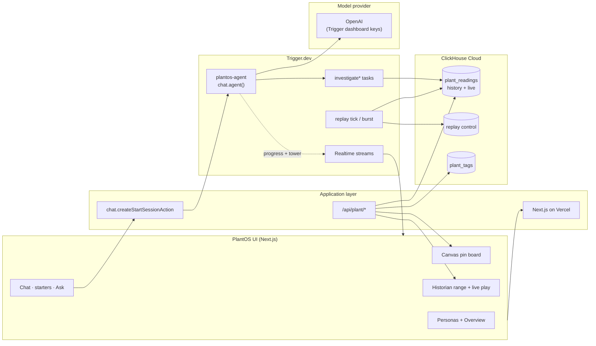
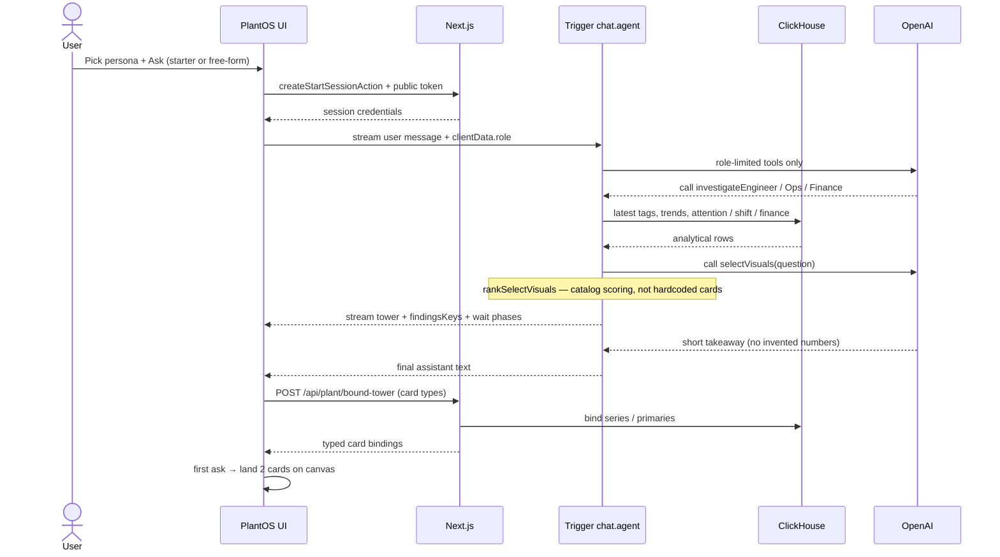

# PlantOS

**One plant. One truth. Different intelligence for every role.**

🔴 **Live demo: [plant-os-nine.vercel.app](https://plant-os-nine.vercel.app)** — a continuously replaying industrial plant in ClickHouse, with role-aware visuals and a Trigger.dev chat agent.

Built as a hackathon demonstration of **thoughtful agents over live plant telemetry** — not a production control or safety system.

---

## 1. What is this?

Industrial teams look at the **same plant** through disconnected tools. Engineers care about tags, limits, and equipment behavior. Operators care about throughput and shift targets. Finance cares about production value and margin. The data is usually the same; the lens is not.

PlantOS is that shared lens:

> **Live telemetry → ClickHouse → role agent (Trigger.dev) → ranked visuals → canvas**

In plain words, the system:

1. **Stores plant telemetry in ClickHouse Cloud** — HAI normal-operation history plus a continuously advancing `live` feed.
2. **Replays history into “now”** with Trigger.dev tasks so the dashboard always has moving readings.
3. Lets you pick a **persona** (Engineer, Operations, Finance, …) and **Ask** a starter or free-form question.
4. Runs a **durable chat agent** (`chat.agent()`) that investigates ClickHouse with **role-limited tools**, then ranks a catalog of Lovable/Replit cards for *this* question.
5. **Binds real series/metrics** onto those cards and lands the first-ask charts on a pinable **canvas** — evidence you can share outbound.

The one-sentence pitch: **most plant UIs show screens — this one answers a role question with live evidence.**

### Why ClickHouse + Trigger.dev together

ClickHouse alone is a fast warehouse. Trigger.dev alone is durable workflows. Together they close the loop:

| Layer | Job |
|---|---|
| **ClickHouse** | Source of truth for tags, trends, limits, and the live replay cursor |
| **Trigger.dev** | Orchestrates the agent, schedules replay, streams progress, holds LLM keys out of the Next.js process |

The LLM **never invents tag values**. It chooses a permitted tool; the tool **queries ClickHouse**; the UI shows the result.

> Plant intelligence should end in evidence — not in a plausible paragraph.

---

## 2. Glossary (read this first)

| Term | Meaning here |
|---|---|
| **Persona / mode** | Shell tab: Overview, Engineer, Operations, Finance, Maintenance, Safety. Each keeps its own chats. Canvas clears when you switch persona — charts appear only after Ask. |
| **Agent role** | One of three specialists the model may use: **engineer**, **operations**, **finance**. Overview / maintenance / safety map onto those tools. |
| **Tower** | A short list of visual card types (≤2 typical, ≤4 for multi-visual asks) selected for the question. |
| **Canvas** | Right-hand pin board. First ask in a chat auto-lands **exactly 2** question-relevant cards; follow-ups stay in chat unless you pin. |
| **Historian range** | On series-capable cards: **1m / 1h / 12h / 24h** window + optional **play** for a rolling live refresh. |
| **Live feed** | Rows in `plant_readings` with `source = 'live'`, advanced by Trigger replay from historical HAI data. |
| **Bound tower** | Tower cards with ClickHouse-derived `binding` (primary, series, items) from `/api/plant/bound-tower`. |
| **selectVisuals** | Agent tool that ranks the visual catalog from the user question (no hardcoded card list for that ask). |

---

## 3. System architecture — the big picture



**How to read this diagram:**

- **The UI** is one workspace: personas on the left, chat + Ask, canvas on the right.
- **Next.js** serves the shell and plant APIs; it does **not** hold the long-running agent loop.
- **Trigger.dev** owns durable chat, investigation tasks, and the replay writer. LLM keys live in the Trigger environment.
- **ClickHouse** is the only plant truth: history, live, tags, and replay cursor.

---

## 4. The closed loop — what happens when you Ask

This is the heart of the product.



**Plain-language walkthrough:**

1. **You ask** — e.g. Engineer Q1 about hydro unit, steam vs hydro MW, component temps, and power vs target.
2. **Trigger starts a durable chat turn** with only that role’s investigate tool.
3. **ClickHouse is queried** for live/history evidence (deterministic SQL via `@clickhouse/client`).
4. **`selectVisuals` ranks** the Lovable catalog from the question text; preferred types are optional hints only.
5. **Next.js binds** the chosen card types to CH series and lands **two** cards on the canvas for the first ask.
6. **Historian controls** (where allowlisted) let you change the window and hit **play** for 1s rolling updates — still from ClickHouse.

---

## 5. How we use ClickHouse

ClickHouse is not a decorative integration. It is the **analytical and live-data foundation**.

### 5.1 Historical telemetry store

PlantOS loads the **HAI 20.07 normal-operation `train1`** dataset into ClickHouse Cloud:

| Property | Value |
|---|---:|
| Historical readings | ~1.5M |
| Distinct plant tags | 24 |
| Dataset rate | 1 Hz |
| Plant areas | Boiler, turbine, water, HIL steam/hydro |
| Primary production signal | `P4_ST_PO` (steam turbine power, MW) |

### 5.2 Schema shaped for time series

```sql
CREATE TABLE plantos.plant_readings (
  ts          DateTime,
  tag         String,
  value       Float64,
  area        LowCardinality(String),
  source      LowCardinality(String) DEFAULT 'history',
  original_ts DateTime,
  loop_id     UInt32 DEFAULT 0
)
ENGINE = MergeTree
ORDER BY (tag, ts);
```

- `source = 'history'` — immutable HAI load  
- `source = 'live'` — replayed “now” rows  
- Trends use `source IN ('live', 'history')` with a rolling window from `max(ts)`

### 5.3 Continuously replayed live feed

Trigger.dev advances history into live:

1. Read replay cursor + speed from a control table in ClickHouse.  
2. Select the next historical timestamps.  
3. Insert new rows with **current wall-clock** `ts`, keeping `original_ts` for provenance.  
4. Idempotency so overlapping workers do not duplicate a tick.

Start / Pause / Reset / speed in the UI talk to `/api/plant/replay` and Trigger burst tasks.

### 5.4 What the app queries

| Use | ClickHouse role |
|---|---|
| Engineer snapshot | Latest boiler/turbine/generator tags, trends, distance to normal band |
| Operations snapshot | Rate, shift progress, utilization, bottleneck area |
| Finance snapshot | Production quantity from CH × **labeled** synthetic rates |
| Card series / historian | Tag trends for 1m–24h windows (downsampled, capped) |
| Live strip | `max(ts)`, row counts, freshness |

**Timezone contract:** naive ClickHouse datetimes are treated as **UTC** and shown in **America/Los_Angeles** via `src/lib/format-time.ts` (charts + overview).

Evidence docs: [`data/HAI_SOURCE.md`](data/HAI_SOURCE.md), [`data/PROOF_CLICKHOUSE.md`](data/PROOF_CLICKHOUSE.md).

---

## 6. How we use Trigger.dev

Trigger.dev is the **orchestration spine**: durable chat, scheduled replay, realtime progress, and isolated secrets.

### 6.1 `chat.agent()` — PlantOS agent

`plantos-agent` (`src/trigger/plant-agent.ts`) uses Trigger **`chat.agent()`** and the React hook **`useTriggerChatTransport`**.

Per turn:

- Next.js mints a scoped session + public token (`chat.createStartSessionAction`).  
- Typed **`clientData.role`** selects which investigate tool exists for that turn.  
- The model must call **investigate\*** then **selectVisuals** (catalog ranker).  
- Progress, towers, and audit events stream as typed UI data parts.  
- Metadata records role, tools, deck, and elapsed time.

LLM API keys stay in the **Trigger dashboard** — not required in the Vercel browser bundle.

### 6.2 Durable tasks

| Task | Purpose |
|---|---|
| `plantos-agent` | Role-aware `chat.agent()` session |
| `plant-investigate` | Single-role ClickHouse investigation |
| `plant-route-investigate` | Route then `triggerAndWait()` |
| `plant-parallel-investigate` | Fan-out all three roles (`batchTriggerAndWait`) |
| `plant-replay-tick` | Scheduled replay spine |
| `plant-replay-burst` | Dense on-demand replay for **Start live** |

Replay tasks share a queue with **`concurrencyLimit: 1`** so scheduled and burst writers never collide. `wait.for()` spaces sub-ticks without holding a long-lived Node process.

### 6.3 Realtime in the UI

- Chat stream → wait phases on the canvas (“Thinking…”, tool names, binding).  
- Replay health → Trigger Realtime run progress while Start is playing.  
- Outbound send → phased Capturing → Sending → Sent from task metadata where wired.

### Why both deterministic tasks and an LLM?

```text
User question → role-limited tool → ClickHouse SQL → typed visuals → short takeaway
```

The LLM chooses tools and explains. **Numbers come from ClickHouse** (or disclosed finance assumptions).

---

## 7. What is real and what is assumed

**Real / data-backed**

- HAI telemetry in ClickHouse Cloud  
- Latest values, trends, attention rankings, replay state  
- Trigger task execution, scheduling, waits, chat sessions, Realtime  
- ClickHouse-bound visualization payloads  

**Synthetic but labeled**

- Capacity / shift targets  
- Electricity, fuel, labor, fixed cost rates  
- Dollar value, margin, variance  

Assumptions: [`data/plant/assumptions.json`](data/plant/assumptions.json).

---

## 8. Try the demo

1. Open [plant-os-nine.vercel.app](https://plant-os-nine.vercel.app).  
2. **Overview** — confirm live feed / Start live if needed.  
3. Switch to **Engineer** (or Ops / Finance) — canvas starts **empty**.  
4. Click a **starter question** or type your own **Ask**.  
5. Wait for the Trigger investigation → takeaway in chat → **two charts** on the canvas.  
6. On series cards: change **1m / 1h / 12h / 24h**, hit **play** for live rolling updates.

Useful asks:

- **Engineer:** hydro unit, steam vs hydro, component temps, power vs target  
- **Operations:** shift target / bottleneck / capacity utilization  
- **Finance:** production value and margin vs plan  

---

## 9. Run locally

### Requirements

- Node.js 20+  
- ClickHouse Cloud (or compatible) URL  
- Trigger.dev project  
- OpenAI key in the **Trigger** environment  

### Setup

```bash
npm install
cp .env.example .env
```

**Next.js (`.env`):**

```env
CLICKHOUSE_URL=https://default:<password>@<host>:8443
TRIGGER_SECRET_KEY=tr_dev_...
TRIGGER_PROJECT_REF=proj_...
```

**Trigger.dev dashboard env:**

```env
CLICKHOUSE_URL=https://default:<password>@<host>:8443
OPEN_AI=sk-...
```

```bash
npm run dev          # http://localhost:3000 (or -p 3001)
npm run dev:trigger  # Trigger worker
```

```bash
npm run build
```

---

## 10. Repository guide

| Path | Purpose |
|---|---|
| `src/app/` | Next.js pages, server actions, `/api/plant/*` |
| `src/components/` | Shell, chat, canvas, Lovable charts, outbound |
| `src/lib/` | ClickHouse client, snapshots, bindings, visual ranker, time (PT) |
| `src/trigger/` | `chat.agent()`, investigate + replay tasks |
| `data/plant/` | Tag map + disclosed assumptions |
| `scripts/` | Loaders, Playwright e2e, selector golden tests |
| `docs/` | Product lock, build, submission notes |
| `lessons/` | Locked plans (first-ask canvas, historian, wait UI, …) |
| `reference/` | Design mockups (not deployed) |

---

## 11. Technology

| Area | Stack |
|---|---|
| Data | ClickHouse Cloud, `@clickhouse/client` |
| Workflows / agent | Trigger.dev 4.x, `chat.agent()`, Realtime |
| App | Next.js 16, React 19, TypeScript |
| AI | Vercel AI SDK, OpenAI (via Trigger) |
| Visuals | Recharts, Lovable/Replit card catalog |
| Host | Vercel |

---

## 12. Status — core loop verified

| Component | Status |
|---|---|
| ClickHouse history + live replay | ✅ |
| Role snapshots (engineer / ops / finance) | ✅ |
| Trigger `chat.agent()` + role tools | ✅ |
| `selectVisuals` catalog ranking | ✅ |
| First-ask canvas (2 cards) + follow-up in chat | ✅ |
| Historian range + live play (UTC→PT axis) | ✅ |
| Persona switch → empty canvas | ✅ |

---

PlantOS closes the loop from **dashboard → Ask → ClickHouse evidence → Trigger orchestration → canvas**, while keeping synthetic finance assumptions honest and visible.
