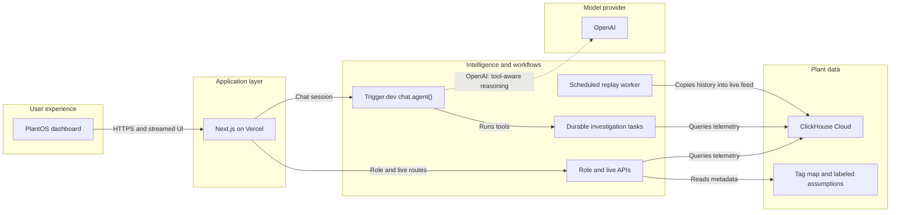
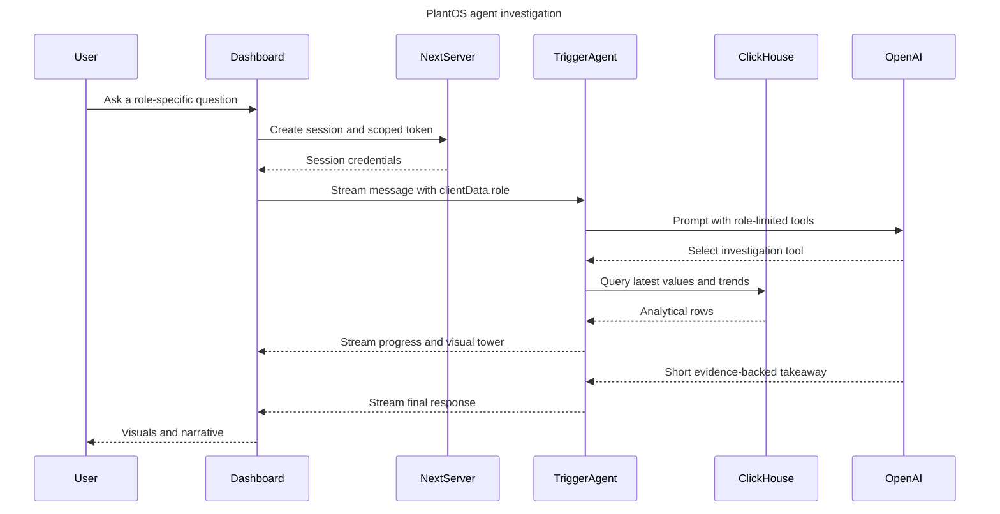

# PlantOS

> **One plant. One truth. Different intelligence for every role.**

PlantOS is an AI-powered industrial operations workspace built on ClickHouse and Trigger.dev. It combines a SCADA-style live overview, role-specific visual workspaces, and a conversational agent that turns plant telemetry into evidence-backed engineering, operations, and finance insights.

- **Live demo:** [plant-os-nine.vercel.app](https://plant-os-nine.vercel.app)
- **Repository:** [github.com/ali-amjad52114/PlantOS](https://github.com/ali-amjad52114/PlantOS)

## Why PlantOS

Industrial teams often look at the same plant through disconnected tools. Engineers care about tags, limits, and equipment behavior; operators care about throughput and shift targets; finance cares about production value and cost.

PlantOS gives every role a different lens over the same ClickHouse-backed source of truth:

- **Overview / SCADA:** live plant status and replay controls.
- **Engineer:** turbine, generator, boiler, trends, and tags nearest their limits.
- **Operations:** production rate, capacity utilization, bottlenecks, and shift performance.
- **Finance:** production value, operating cost, margin, and variance from plan.
- **Maintenance:** equipment health, deviation, vibration, thermal, and inspection priorities.
- **Safety:** limit proximity, alerts, band violations, and plant-area views.

The six interface modes are grounded through three agent specialists: **Engineer**, **Operations**, and **Finance**. Overview, Maintenance, and Safety use the appropriate engineering or operational data bindings rather than pretending there are separate unsupported agents.

## System architecture



## How ClickHouse is used

ClickHouse is not a decorative integration. It is the analytical and live-data foundation of the product.

### 1. Historical telemetry store

PlantOS loads the **HAI 20.07 normal-operation `train1` dataset** into ClickHouse Cloud:

| Property | Value |
|---|---:|
| Historical readings | 1,486,080 |
| Distinct plant tags | 24 |
| Dataset rate | 1 Hz |
| Historical period | 2019-09-11 to 2019-09-15 |
| Plant areas | Boiler, turbine, water treatment, and HIL steam/hydro |
| Primary production signal | `P4_ST_PO` - steam-turbine power output |

The source dataset contains 309,600 timestamps. PlantOS normalizes selected signals into a long-form analytical table, creating one row per timestamp and tag.

### 2. Schema designed for time-series analysis

```sql
CREATE TABLE plantos.plant_readings (
  ts          DateTime,
  tag         String,
  value       Float64,
  area        LowCardinality(String),
  source      LowCardinality(String) DEFAULT 'history',
  original_ts DateTime,
  loop_id     UInt32 DEFAULT 0
)
ENGINE = MergeTree
ORDER BY (tag, ts);

CREATE TABLE plantos.plant_tags (
  tag         String,
  label       String,
  area        String,
  unit        String,
  normal_min  Float64,
  normal_max  Float64,
  description String,
  kind        String
)
ENGINE = MergeTree
ORDER BY tag;
```

This structure supports fast latest-value queries, recent trends, area-level aggregation, comparisons against normal ranges, and separation of historical versus replayed live rows.

### 3. Continuously replayed live feed

Trigger.dev advances the historical dataset into a simulated live feed. Each replay tick:

1. Reads the current replay cursor and speed from ClickHouse.
2. Selects the next historical timestamps with parameterized ClickHouse queries.
3. Copies their tag values into new rows with current wall-clock timestamps.
4. Preserves `original_ts` for provenance.
5. Uses idempotency checks so overlapping workers cannot duplicate a historical timestamp.

The same `plant_readings` table therefore supports both:

- `source = 'history'` for the immutable dataset.
- `source = 'live'` for the continuously advancing demo feed.

Replay state is stored in a small `ReplacingMergeTree` control table. Start, pause, reset, and speed changes are therefore shared state rather than browser-only animation.

### 4. Role-specific analytical queries

The application queries ClickHouse through `@clickhouse/client` to produce deterministic snapshots:

- **Engineer:** latest boiler, turbine, and generator values; recent trends; normal-range distance; attention ranking.
- **Operations:** current production rate; shift production; projected output; utilization; bottleneck area.
- **Finance:** production quantity from ClickHouse combined with explicitly labeled demo rates to calculate value, cost, margin, and variance.
- **Live health:** latest live timestamp, row counts, replay state, and feed freshness.

The `/api/plant/bound-tower` route also binds ClickHouse results directly to the visual-card catalog. Suggested questions therefore populate real visualization payloads instead of returning static screenshots.

### ClickHouse data flow

```mermaid
flowchart LR
    sourceData["HAI train1 CSV"] -->|"Normalize selected tags"| loader["Python loader"]
    loader -->|"Insert JSONEachRow"| history["plant_readings: history"]
    history -->|"Read next timestamps"| replay["Trigger.dev replay task"]
    replay -->|"Insert current timestamps"| live["plant_readings: live"]
    history -->|"Trends and aggregates"| snapshots["Role snapshots"]
    live -->|"Latest values and freshness"| snapshots
    snapshots -->|"Typed card bindings"| dashboard["Visual stage and chat towers"]
```



## How Trigger.dev and `chat.agent()` are used

Trigger.dev supplies the durable workflow and conversational orchestration layer.

### Durable conversational agent

`plantos-agent` is implemented with Trigger.dev `chat.agent()` and connected to the React interface with `useTriggerChatTransport`.

For every conversation:

- The server creates a scoped chat session and one-hour public token.
- Typed `clientData.role` selects the specialist tool available for that turn.
- The model receives only the matching Engineer, Operations, or Finance investigation tool.
- Shared tools expose live-feed status and validated supplemental visualizations.
- Investigation progress, tower cards, and audit data stream into the UI as typed data parts.
- Turn hooks record the role, tools used, selected visual deck, and elapsed time in Trigger.dev metadata.

This keeps role selection explicit and prevents the model from calling irrelevant plant tools.

### Chat request flow



### Trigger.dev tasks

| Task | Purpose |
|---|---|
| `plantos-agent` | Durable `chat.agent()` session with role-aware tools and streamed UI data. |
| `plant-investigate` | Deterministic Engineer, Operations, or Finance ClickHouse investigation. |
| `plant-route-investigate` | Routes a question to one specialist, then uses `triggerAndWait()` and checks `Result.ok`. |
| `plant-parallel-investigate` | Fans out to all three specialists with `batchTriggerAndWait()`. |
| `plant-replay-tick` | Scheduled replay spine that advances telemetry every minute. |
| `plant-replay-burst` | On-demand dense replay used by the Start control. |

The replay tasks share a queue with `concurrencyLimit: 1`, ensuring the scheduled writer and an on-demand burst cannot write simultaneously. Durable `wait.for()` calls space replay sub-ticks without holding a conventional server process open.

### Why both deterministic tasks and an LLM?

The LLM decides which permitted tool to use and explains the result. It does **not** invent telemetry or calculate plant state from prose.

The data path remains deterministic:

```text
User question -> role-limited tool -> ClickHouse query -> typed visual payload -> concise explanation
```

If LLM-based routing is unavailable, the standalone routing task has a keyword fallback so the demo can still select an appropriate specialist.

## What is real and what is assumed

Transparency matters in an industrial interface.

**Real / data-backed:**

- HAI 20.07 telemetry stored in ClickHouse Cloud.
- Latest readings, histories, trends, tag rankings, and replay state.
- Trigger.dev task execution, scheduling, concurrency control, waits, metadata, and streamed chat sessions.
- Role APIs and ClickHouse-bound visualization payloads.

**Synthetic but clearly labeled:**

- Plant capacity and shift targets.
- Electricity value, fuel cost, labor cost, and fixed operating cost.
- Revenue, margin, and variance calculations derived from those demo rates.

The assumptions live in [`data/plant/assumptions.json`](data/plant/assumptions.json) and are identified in the interface. PlantOS is a hackathon demonstration, not a production control or safety system.

## Try the demo

1. Open the [live PlantOS deployment](https://plant-os-nine.vercel.app).
2. Use **Overview / SCADA** to confirm that the live feed is active.
3. Switch to **Engineer**, **Operations**, or **Finance**.
4. Choose a suggested question or ask your own.
5. Watch the investigation progress while Trigger.dev streams the visual tower and final takeaway.
6. Compare role perspectives: each view uses the same underlying ClickHouse telemetry.

Useful questions:

- **Engineer:** Which tags are closest to their normal limits?
- **Operations:** Are we on track to meet the current shift target?
- **Finance:** What is the current production value and margin versus plan?

## API surface

| Route | Description |
|---|---|
| `GET /api/plant/live` | Live/history counts, latest timestamps, freshness, and replay control. |
| `GET /api/plant/engineer` | Engineer snapshot from plant telemetry. |
| `GET /api/plant/operations` | Operations snapshot and shift calculations. |
| `GET /api/plant/finance` | Finance snapshot with labeled synthetic assumptions. |
| `GET /api/plant/bound-tower?mode=engineer&q=0` | Question-to-card mapping populated with ClickHouse-derived bindings. |
| `POST /api/plant/replay` | Start, pause, reset, speed, or replay actions. |

## Run locally

### Requirements

- Node.js 20+
- A ClickHouse instance or ClickHouse Cloud service
- A Trigger.dev project
- An OpenAI API key configured in Trigger.dev

### Installation

```bash
npm install
cp .env.example .env
```

Configure the Next.js environment:

```env
CLICKHOUSE_URL=https://default:<password>@<host>:8443
TRIGGER_SECRET_KEY=tr_dev_...
TRIGGER_PROJECT_REF=proj_chhoeiuksrbzqtmfiuxd
```

Configure the Trigger.dev dashboard environment:

```env
CLICKHOUSE_URL=https://default:<password>@<host>:8443
OPEN_AI=sk-...
```

Start the app and Trigger.dev worker in separate terminals:

```bash
npm run dev
```

```bash
npm run dev:trigger
```

Open [http://localhost:3000](http://localhost:3000).

### Production check

```bash
npm run build
```

## Repository guide

| Path | Purpose |
|---|---|
| `src/app/` | Next.js pages, server actions, and plant API routes. |
| `src/components/` | Premium shell, chat UI, SCADA controls, charts, and visual catalog. |
| `src/lib/` | ClickHouse client, replay logic, snapshots, card bindings, and typed payloads. |
| `src/trigger/` | `chat.agent()` and durable Trigger.dev tasks. |
| `data/plant/` | Plant metadata, tag map, and disclosed demo assumptions. |
| `scripts/` | Dataset loading, seeding, and verification utilities. |
| `docs/` | Product, demo, build, and submission documentation. |
| `lessons/` | Engineering plans, correctness rules, and implementation learnings. |
| `reference/` | Local design references and clickable HTML mockups; not deployed. |

## Evidence and attribution

- [`data/HAI_SOURCE.md`](data/HAI_SOURCE.md) documents dataset source, version, checksum, period, and fallback choice.
- [`data/PROOF_CLICKHOUSE.md`](data/PROOF_CLICKHOUSE.md) records the ClickHouse count, time range, distinct tags, and query statistics.
- HAI dataset source: [icsdataset/hai](https://github.com/icsdataset/hai).

## Technology

- **Data:** ClickHouse Cloud, `@clickhouse/client`
- **Workflows and agent:** Trigger.dev, `chat.agent()`, Trigger Realtime
- **Application:** Next.js 16, React 19, TypeScript
- **AI:** Vercel AI SDK, OpenAI
- **Visuals:** Recharts, typed visual-card catalog, streamed plant towers
- **Hosting:** Vercel

---

PlantOS demonstrates a closed loop from **dashboard -> insight -> action-ready workflow**, while keeping the underlying evidence visible and the demo assumptions honest.
